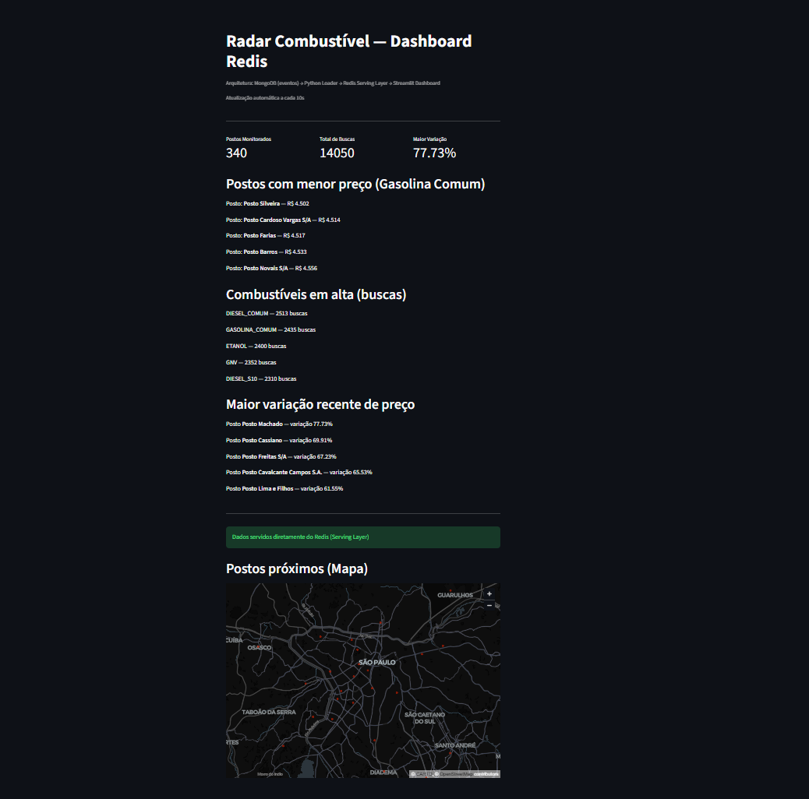
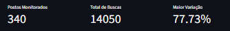
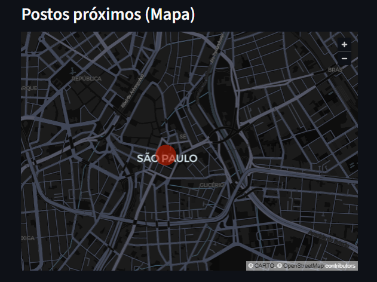
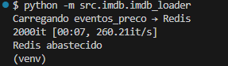
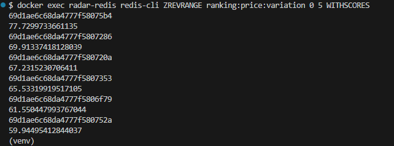

# Radar Combustível — IMDB Project

Projeto desenvolvido para o **Trabalho Final — MBA Engenharia de Dados (SENAC)**.

O sistema simula um **pipeline moderno de dados orientado a eventos**, utilizando MongoDB, Redis e Streamlit para análise em tempo quase real de preços de combustíveis.

---

## Objetivo

Construir uma arquitetura de dados capaz de:

* ingerir eventos de preços de combustíveis;
* processar dados via pipeline Python;
* disponibilizar consultas rápidas usando Redis (Serving Layer);
* visualizar insights em tempo real através de dashboard interativo.

---

## Arquitetura da Solução

```
MongoDB (Eventos)
        ↓
Python Loader (IMDB Pipeline)
        ↓
Redis (Serving Layer)
        ↓
Streamlit Dashboard
```

---

### Camadas da Arquitetura

- **Ingestão — MongoDB**  
  Armazena eventos de atualização de preços.

- **Processamento — Python Loader**  
  Lê eventos e transforma dados para estruturas otimizadas.

- **Serving Layer — Redis**  
  Mantém dados em memória para consultas rápidas.

- **Visualização — Streamlit**  
  Dashboard analítico interativo.

---


## Tecnologias Utilizadas

* Python 3.10+
* MongoDB
* Redis
* Docker & Docker Compose
* Streamlit
* Pandas

---

## Estruturas Redis Utilizadas

| Estrutura  |           Key                  |         Finalidade        |
|------------|--------------------------------|---------------------------|
| Sorted Set | `ranking:GASOLINA_COMUM:price` | Ranking de menores preços |
| Sorted Set | `ranking:search:fuel`          | Combustíveis em alta      |
| Sorted Set | `ranking:price:variation`      | Analytics de variação     |
| GEO        | `stations:geo`                 | Localização geográfica    |

**Motivação técnica**
Redis foi utilizado como camada de *read-optimized serving*, permitindo consultas de baixa latência ideais para dashboards analíticos.


---

## Como Executar o Projeto

### Clonar repositório

```bash
git clone https://github.com/Lucascosta-dbm/radar-combustivel-imdb.git
cd radar-combustivel-imdb
```

---

### Criar ambiente virtual

```bash
python -m venv venv
venv\Scripts\activate
```

---

### Instalar dependências

```bash
pip install -r requirements.txt
```

---

### Subir infraestrutura (MongoDB + Redis)

```bash
docker-compose up -d
```

---

### Executar pipeline MongoDB → Redis

```bash
python -m src.imdb.imdb_loader
```

---

### Executar Dashboard

```bash
streamlit run dashboard.py
```

Acesse:

```
http://localhost:8501
```

---

## Funcionalidades

* KPIs em tempo real
* Ranking de postos mais baratos
* Combustíveis em tendência
* Análise de variação de preços
* Visualização geográfica (Redis GEO)
* Atualização automática do dashboard

---

## Estrutura do Projeto

```
radar-combustivel-imdb/
│
├── src/
│   ├── config/
│   └── imdb/
│
├── docs/
│   └── prints/
│
├── dashboard.py
├── docker-compose.yml
├── requirements.txt
└── README.md
```

---

## Evidências Visuais

Imagens do funcionamento encontram-se em:

`/docs/prints`

### Dashboard



### KPIs em tempo real



### Mapa de Postos (Redis GEO)



### Pipeline MongoDB → Redis



### Consulta Redis



## Integrantes

Danielle dos Santos Romano
Lucas Pereira Costa
Michael Pablo Gomes da Silva
Tatiana Germuzesque dos Santos Pleger

## Licença

Projeto acadêmico — uso educacional.
